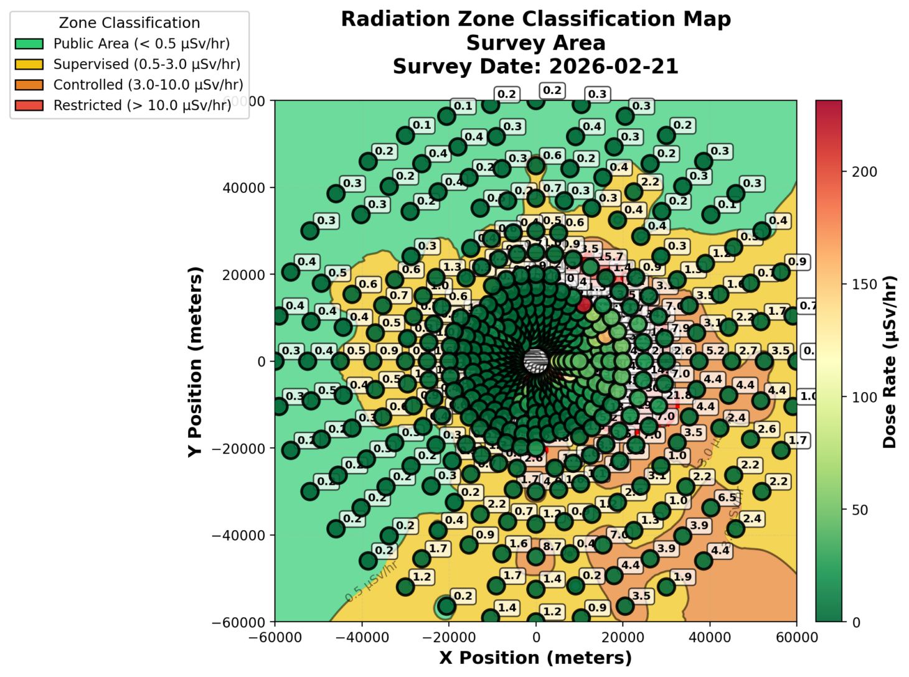

# Radiation Zone Classification & Shielding Design Engine

**A computational framework for automated radiological zoning and civil engineering shielding mitigation in high-energy physics facilities.**


---

## 1. Overview

This project bridges the gap between dosimetric survey data and civil infrastructure management. In high-energy physics environments (accelerator tunnels) and environmental remediation sites, translating detector readings into structural shielding requirements is often a manual, iterative process.

This framework automates the workflow by:
1.  **Context-Aware Interpolation:** Utilizing **Inverse Distance Weighting (IDW)** and **Clough-Tocher scheme** for point-source hotspots (mimicking $1/r^2$ physics) and **Linear Barycentric Triangulation** for long-geometry accelerator tunnels.
2.  **Regulatory Compliance:** Auto-classifying zones based on **CERN Safety Code F** and **IAEA Basic Safety Standards**.
3.  **Shielding Remediation:** Calculating the required physical barrier thickness ($x$) for concrete, steel, lead, high-density
polyethylene (HDPE) and materials like Bentonite Slurry or Compacted Earth/Soil ($\rho$ = 1.80) using a deterministic **Linear Attenuation Model**.

---

## 2. Key Features

*   **Multi-Model Interpolation:**
    *   **IDW (Inverse Distance Weighting):** Deterministic hotspot mapping for beam targets and scattered sources.
    *   **Linear/Barycentric:** Artifact-free mapping for long tunnels and corridors (prevents "overshooting" negative values).
    *   **Clough-Tocher (Cubic):** $C^1$ continuous surface reconstruction for visualizing smooth dose gradients and soft transitions in dense survey datasets.
*   **Dynamic Zoning:** Instantly segments areas into *Public*, *Supervised*, *Controlled*, and *Restricted* zones.
*   **Deterministic Shielding:** Solves the **Beer-Lambert Law** for identified hotspots to determine necessary wall thickness.
*   **Extended Material Library:** Includes attenuation coefficients ($\mu$) for:
    *   Standard Concrete ($\rho=2.35$)
    *   Heavy Concrete (Barite)
    *   Steel & Lead
    *   Bentonite Slurry (Low-cost geocomposite)
    *   Borated Bentonite
    *   HDPE (Neutron moderation benchmark)
    *   Earth or soil ($\rho$ = 1.80)

---

## 3. Validation Scenarios

To ensure robustness, the engine was stress-tested against two distinct radiological topologies:

### Case A: LHC Accelerator Tunnel (Simulated)
*   **Topology:** Linear geometry (50m length).
*   **Method:** **Linear Interpolation**.
*   **Objective:** Map dose gradients along a beamline without generating artificial "ringing" or negative dose artifacts common in cubic spline methods.
*   **Result:** Successfully identified the **Supervised Area** boundary at 35m from the beam dump with 0% interpolation overshoot.


*Fig 1. Interpolated dose map of a tunnel segment showing zone classification contours. Source intensities scaled for demonstration; full-facility modeling requires Monte Carlo transport codes.*

### Case B: Chernobyl Exclusion Zone 
*   **Topology:** Scattered environmental hotspots.
*   **Method:** **Inverse Distance Weighting (IDW)** ($p=2$, k-Nearest Neighbors).
*   **Objective:** Resolve discrete contamination points in a high-noise environment.
*   **Result:** Correctly isolated 3 distinct hotspots ($> 25 \mu\text{Sv/h}$) and generated a "Restricted" zone contour map consistent with $1/r^2$ decay physics.


*Fig 2. Interpolated dose map of Chernobyl Exclusion Zone showing zone classification contours.*

---

## 4. Theoretical Framework

### Zone Classification Standards
Classification logic is derived from **CERN Safety Code F** thresholds assuming 2000 hours occupancy per
year under normal working conditions (Configurable):

| Zone | Dose Rate ($\mu Sv/h$) | Engineering Controls Required |
| :--- | :--- | :--- |
| 🟢 **Public** | $< 0.5$ | None |
| 🟡 **Supervised** | $0.5 - 3.0$ | Radiological Monitoring |
| 🟠 **Controlled** | $3.0 - 10.0$ | Dosimetry, Access Control |
| 🔴 **Restricted** | $> 10.0$ | **Physical Barriers / Interlocks** |

### Physics Engine: IDW Interpolation
For source-dominated environments, we utilize Inverse Distance Weighting to preserve physical accuracy:

$$ Z(x) = \frac{\sum w_i z_i}{\sum w_i}, \quad w_i = \frac{1}{d(x, x_i)^p} $$

Where $p=2$ represents the Inverse Square Law inherent to photon radiation.

### Shielding Design Logic
For grid cells classified as **Restricted**, the system computes the minimum shielding thickness ($x$) using the inverted **Beer-Lambert** Law:

$$ x = -\frac{\ln(I_{target} / I_{source})}{\mu(E)} $$

Where $\mu(E)$ is the energy-dependent linear attenuation coefficient sourced from **NIST XCOM** at 1.0 MeV.

---

## 5. Usage

### Prerequisites
*   Python 3.8+
*   **SciPy** (Spatial interpolation: `cdist`, `griddata`, `cKDTree`)
*   **Pandas** (Data manipulation)
*   **Streamlit** (Visualization Dashboard)

### Installation & Execution

```bash
# 1. Clone the repository
git clone https://github.com/aw920h/radiation-mapper.git

# 2. Install dependencies
pip install -r requirements.txt

# 3. Run the analysis engine (Generates Maps & Reports)
python radiation_mapper.py

# 4. Launch the Interactive Dashboard
streamlit run app.py
```

### Sample Output (Compliance Report)
```text
[ALERT] RESTRICTED ZONE DETECTED AT [X: 25.0m, Y: 15.0m]
-----------------------------------------------------
INPUT METRICS:
  Source Intensity:  100.9 µSv/hr (Beamline Hotspot)
  Target Threshold:  0.5 µSv/hr (Public Limit)
  Photon Energy:     1.0 MeV

REMEDIATION OPTIONS (THICKNESS REQUIRED):
  > Ordinary Concrete:  35.39 cm
  > Steel:              17.69 cm
  > Lead:               9.65 cm
  > Bentonite Slurry:   52.12 cm (Cost-effective option)

RECOMMENDATION:
  Deploy 40cm reinforced concrete wall or restricted access gate.
```

---

## 6. References & Standards

This software implements standards defined in the following regulatory and technical frameworks:

1.  **CERN HSE Unit.** (2006). *CERN Safety Code F: Radiation Protection*. [EDMS 335729](https://edms.cern.ch/ui/file/335729/LAST_RELEASED/F_E.PDF)
2.  **IAEA.** (2014). *Radiation Protection and Safety of Radiation Sources: International Basic Safety Standards (GSR Part 3)*. Vienna: IAEA.
3.  **NIST.** (2010). *XCOM: Photon Cross Sections Database*. National Institute of Standards and Technology.
4.  **Shepard, D.** (1968). *A two-dimensional interpolation function for irregularly-spaced data*. Proceedings of the 1968 23rd ACM National Conference. (Basis for IDW).

---
*Disclaimer: This tool is a computational aid for preliminary design and research. Final shielding verification must be conducted via Monte Carlo transport codes (FLUKA/Geant4) and approved by a certified Radiation Protection Officer.*
