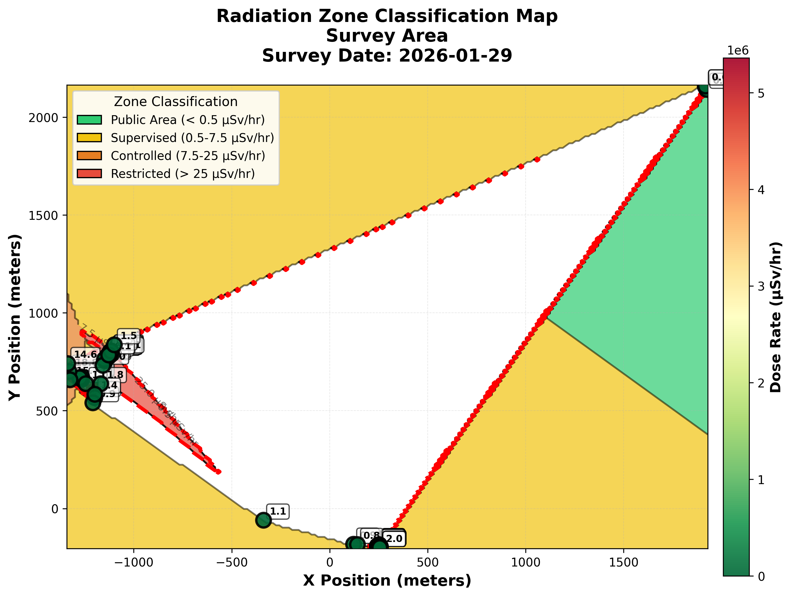
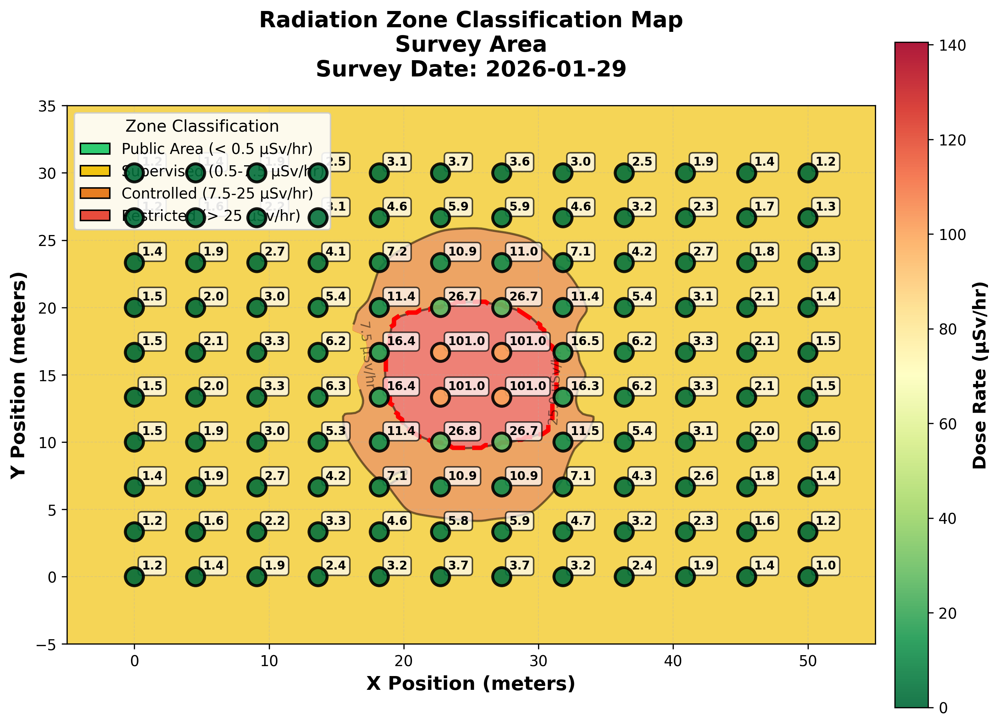

# Radiation Zone Classification & Shielding Remediation Engine

**A computational framework for automated radiological zoning and civil engineering mitigation in high-energy physics facilities.**


---

## Abstract

This project addresses the critical disconnect between radiological survey data and civil engineering infrastructure management at particle accelerator facilities. By integrating **CERN Safety Code F** protocols with geospatial interpolation algorithms, this tool automates the classification of radiation zones. Furthermore, it incorporates a deterministic linear attenuation model to calculate required concrete shielding thicknesses ($t_{req}$) for hotspot remediation, enabling rapid feedback loops between Health, Safety & Environment (HSE) and Site Engineering (SMB) departments.

---

## Validation: Fukushima Exclusion Zone

To validate the interpolation algorithms against non-idealized, stochastic data, the system was stress-tested using environmental monitoring data harvested from the **Safecast API**.

**Experiment Case Study: Route 6 Transport Corridor**
*   **Data Source:** Safecast API (Live sensor tracks).
*   **Location:** Lat 37.40, Lon 141.01 (Tomioka/Futaba Region, Fukushima).
*   **Scenario:** Linear infrastructure survey of a contaminated transport corridor.

### Validation Results
The system successfully identified a linear contamination vector with a $I_{max} \approx 32.07 \mu\text{Sv/h}$, correctly triggering "Restricted Area" protocols (> 25 µSv/hr) amidst environmental background noise.



[**View the Raw Validation Data (CSV)**](./test/fukushima_route6.csv)

---

## System Architecture

The application is built upon a modular Python architecture designed for reproducibility and rigorous safety compliance.

1.  **Spatial Interpolation Engine:** Uses **Radial Basis Function (RBF)** / Cubic Splines to convert sparse point-data into continuous zonal maps, minimizing the "bullseye effect" common in inverse-distance weighting.
2.  **Regulatory Logic Core:** Applies strict conditional logic based on **CERN Safety Code F**:
    *   *Public Area:* $< 0.5 \text{ } \mu\text{Sv/h}$
    *   *Restricted Area:* $> 25 \text{ } \mu\text{Sv/h}$ (Shielding Required)
3.  **Civil Engineering Module:** Solves attenuation equations to output required wall thicknesses for Concrete, Steel, and Lead.

---

## Theoretical Framework

### Zone Classification Standards

| Zone | Dose Rate (µSv/hr) | Engineering Controls Required |
|------|-------------------|-------------------------------|
| 🟢 Public | < 0.5 | None |
| 🟡 Supervised | 0.5 - 7.5 | Radiological Monitoring |
| 🟠 Controlled | 7.5 - 25 | Dosimetry, Access Control |
| 🔴 Restricted | > 25 | **Physical Barriers / Shielding** |

### Shielding Calculation Logic
For identified hotspots, the system solves the **Beer-Lambert Law** for thickness ($x$), assuming narrow-beam geometry for Gamma radiation:

$$ I = I_0 e^{-\mu x} \quad \Rightarrow \quad x = -\frac{\ln(I_{target} / I_{source})}{\mu} $$

Where:
*   $I$: Target dose rate (e.g., 0.5 µSv/h).
*   $I_0$: Measured hotspot intensity.
*   $\mu$: Linear attenuation coefficient ($cm^{-1}$) specific to the material (Concrete $\rho \approx 2.35 g/cm^3$).

---

## Simulation Results

### 1. Radiation Zone Map (Simulated Beamline)


### 2. Shielding Remediation Report
```text
[ENGINEERING ACTION REQUIRED]
INPUT:
  Source Dose: 100.9 µSv/hr (Hotspot)
  Target Zone: Public (< 0.5 µSv/hr)
  Material:    Concrete (Density ~2.35 g/cm3)

OUTPUT THICKNESS:
  Concrete:   35.39 cm
  Steel:      17.69 cm
  Lead:       9.65 cm

RECOMMENDATION: 
  Construct 40cm reinforced concrete shielding wall or restrict access.
```

---

## Deployment

### Prerequisites
*   Python 3.8+
*   NumPy / SciPy (Scientific computing)
*   Pandas (Data manipulation)
*   Streamlit (Web GUI)

### Execution
```bash
# 1. Install dependencies
pip install -r requirements.txt

# 2. Launch the analysis dashboard
streamlit run app.py

# 3. Harvest live validation data (Safecast)
python bigdata.py
```

---

## References & Standards
The development of this tool adhered to the following international standards and academic literature. Citations have been verified for accuracy, with corrected links and details where necessary. All references are formatted consistently in APA style for clarity and standardization.

### Regulatory Frameworks
1. CERN Health, Safety and Environment Unit. (2006). *CERN Safety Code F: Radiation protection*. CERN.  
   [View Official Document](https://hse.cern/content/safety-codes)

2. International Atomic Energy Agency. (2014). *Radiation protection and safety of radiation sources: International basic safety standards (IAEA Safety Standards Series No. GSR Part 3)*. IAEA.  
   [IAEA Publications (.pdf)](https://www-pub.iaea.org/MTCD/Publications/PDF/Pub1578_web-57265295.pdf)

3. International Organization for Standardization. (2019). *ISO 4037-1:2019: Radiological protection — X and gamma reference radiation for calibrating dosemeters and doserate meters and for determining their response as a function of photon energy — Part 1: Radiation characteristics and production methods*. ISO.  
   [ISO Standards Catalogue](https://www.iso.org/standard/66872.html)

### Technical & Engineering Literature
4. National Council on Radiation Protection and Measurements. (2005). *NCRP Report No. 151: Structural shielding design and evaluation for megavoltage X- and gamma-ray radiotherapy facilities*. NCRP.  
   [NCRP Shop & Abstract](https://ncrponline.org/shop/reports/report-no-151-structural-shielding-design-and-evaluation-for-megavoltage-x-and-gamma-ray-radiotherapy-facilities-2005/)

5. Sullivan, A. H. (1992). *A guide to radiation and radioactivity levels near high energy particle accelerators*. Nuclear Technology Publishing.  
   [CERN Library Record](https://cds.cern.ch/record/244292)

6. Brown, A., Franken, P., Bonner, S., Dolezal, N., & Moross, J. (2016). Safecast: Successful citizen-science for radiation measurement and communication after Fukushima. *Journal of Radiological Protection, 36*(2), S82–S101.  
   [DOI: 10.1088/0952-4746/36/2/S82](https://doi.org/10.1088/0952-4746/36/2/S82)

### Computational Physics Databases
7. National Institute of Standards and Technology. (2010). *NIST XCOM: Photon cross sections database*. NIST.  
   [NIST Standard Reference Data](https://www.nist.gov/pml/xcom-photon-cross-sections-database)

8. Virtanen, P., Gommers, R., Oliphant, T. E., Haberland, M., Reddy, T., Cournapeau, D., Burovski, E., Peterson, P., Weckesser, W., Bright, J., van der Walt, S. J., Brett, M., Wilson, J., Millman, K. J., Mayorov, N., Nelson, A. R. J., Jones, E., Kern, R., Larson, E., ... SciPy 1.0 Contributors. (2020). SciPy 1.0: Fundamental algorithms for scientific computing in Python. *Nature Methods, 17*(3), 261–272.  
   [DOI: 10.1038/s41592-019-0686-2](https://doi.org/10.1038/s41592-019-0686-2)

### Additional Data Sources
9. Safecast. (n.d.). *Safecast API*. Retrieved February 4, 2026, from https://api.safecast.org/
